::: {.cell}

:::

## The initial lexicon

Average 20-year-old knows ~42,000 lemmas: **mental lexicon**

. . .

::: box
Lexical representations
: Phonological, conceptual, grammatical information of known words
:::

. . .

**First lexical representations at 6-9 months**

* Inter-modal experimental paradigms [@bergelson2012months; @tincoff1999beginnings]
* Parental reports and surveys  [e.g., CDI, @fenson1994variability]

::: {.notes}

* The average English 20-year-old knows around 42,000 words
* The collection of words that an adult knows is known as the *mental lexicon*
* The *mental lexicon* is formed by *lexical representations*, each embedding phonological, conceptual, and grammatical information about words
* In the last five years, we have explored the initial lexicon through the lens of a particular case of language learning: bilingual infants
* The foundations of a lexicon are laid by the first form-meaning mappings at 6 months
* Two sources of evidence: inter-modal experimental paradigms and parental reports
* The internal workings of this initial lexicon are still unclear

:::

## Normative trajectories of lexical development

Vocabulary size norms for 51,800 monolingual children learning 35 distinct languages [@frank2017wordbank]
 

::: notes

Vocabulary size grows non-linearly during the second year of life

:::

## Bilinguals face additional challenges, but do not lag behind

 
 

::: columns
:::: {.column width="33%"}
::::: {.fragment fragment-index=1}
:::::: box
Increased **complexity** in linguistic context
::::::
:::::
::::
:::: {.column width="33%"}
::::: {.fragment fragment-index=2}
:::::: box
Reduced linguistic **input** in each language
::::::
:::::
::::
:::: {.column width="33%"}
::::: {.fragment fragment-index=3}
:::::: box
Increased **referential ambiguity**
::::::
:::::
::::
:::
::: columns
:::: {.column width="33%"}
::::: {.fragment fragment-index=1}
Two overlapping codes
:::::
::::
:::: {.column width="33%"}
::::: {.fragment fragment-index=2}
Split into two languages
:::::
::::
:::: {.column width="33%"}
::::: {.fragment fragment-index=3}
\> 2 labels per referent 
:::::
::::
:::

## Bilinguals face additional challenges, but do not lag behind

::: box
**Hoff et al. (2012)**: bilinguals acquire words at similar rates as monolinguals
:::

::: columns
:::: {.column}
::::: fragment
{width="85%"}
:::::
::::
:::: {.column}
::::: fragment
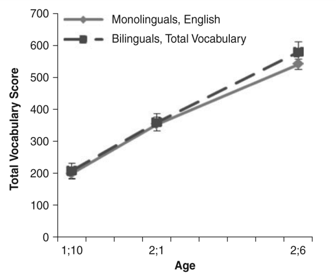{width="90%"}
:::::
::::
:::

::: notes

1. Two grammatical systems, two phoneme inventories, two sets of word-forms
2. Lower quantitative, relative to monolinguals
3. Two sets of words for the same referents
4. Bilinguals keep up with monolinguals (language discrimination, grammar, lexicon)

:::

## Lexical similarity modulates vocabulary growth in bilinguals

::: columns
:::: {.column}
::::: box
**Floccia et al. (2018)**: CDI responses of 372 bilinguals learning **English + additional language**
:::::
::::
:::: {.column}
::::: fragment
**Lexical similarity**: Average phonological similarity (Levenshtein) between pairs of translations
:::::
::::
:::

 

. . .

**Higher lexical similarity, larger vocabulary size**

Stronger effect in the additional language (e.g., Dutch, Mandarin)

## Lexical similarity modulates vocabulary acquisition in bilinguals

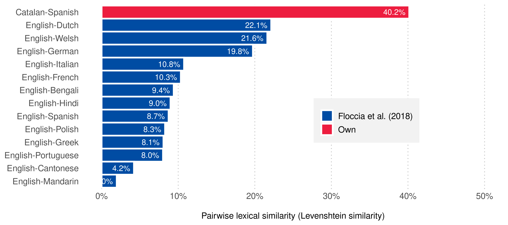

## A cognate facilitation in lexical acquisition?

::: columns
:::: {.column}
**Cognates**: Phonologically-similar translation equivalents

| *Cognate*           | *Non-cognate*       |
|:-------------------:|:-------------------:|
| [cat] /ˈgat-ˈga.to/ | [dog] /ˈgos-ˈpe.ro/ |
::::
:::: {.column}
:::::  fragment
Some evidence that cognates **acquired earlier** than non-cognates [@mitchell2023cognates; @bosch2014first]
:::::
::::
::: 

 

. . .

::: box
**What *mechanisms* support a cognate facilitation during word acquisition?**
:::

## Lexical access is language non-selective in bilinguals

{ width="150%" }

## The present dissertation

::: columns
::: {.column}
:::  fragment
::: box
**Study 1**
:::
1. Provide a mechanistic account for the **cognateness facilitation**
2. **Test predictions** of the model

> Under review in *Child Development* (R2),  
:::
:::
::: {.column}
:::  fragment
::: box
**Study 2**
:::
3. Test core assumption of the model: **Language non-selectivity** in the initial lexicon

> In preparation 
:::
:::
:::

# Study 1 {.inverse}

*Cognate beginnings to lexical acquisition: The AMBLA model*

## **A**ccumulator **M**odel of **B**ilingual **L**exical **A**cquisition (**AMBLA**)

::: box

1. **Accumulation** of information about **form-meaning mappings**:

**Learning instances**: Exposure to a word-form that results in the accumulation of information about its meaning

:::: fragment

2. **Age of acquisition**: The infant accumulates a **threshold** amount of learning instances for a word-form

::::
:::

. . .

$$
\begin{aligned}
\definecolor{myred}{RGB}{ 168, 0, 53 }
\definecolor{myblue}{RGB}{ 0, 64, 168 }
\definecolor{mygreen}{RGB}{0, 168, 87}
\definecolor{grey}{RGB}{128, 128, 128}
\textbf{For participant } &i \textbf{ and word-form } j \text{ (translation of } j'): \\
{\color{mygreen}\text{Age of Acquisition}_{ij}} &= \{\text{Age}_i \mid {\color{myred}\text{Learning instances}_{ij}} = {\color{myblue}\text{Threshold}} \}\\
{\color{myred}\text{Learning instances}_{ij}} &= \text{Age}_i \cdot \text{Freq}_j \\
\end{aligned}
$$

## AMBLA: Simulating *monolingual* word acquisition

::: columns
:::: {.column width="40%"}

Catalan monolingual child

- /'gos/ (Catalan), 100%

**Parameters**:

$$
\begin{aligned}
\text{Threshold} = 300 \\
\text{Freq}_j \sim \text{Poisson}(\lambda = 50) 
\end{aligned}
$$
::::
:::: {.column width="60%"}
::::: fragment
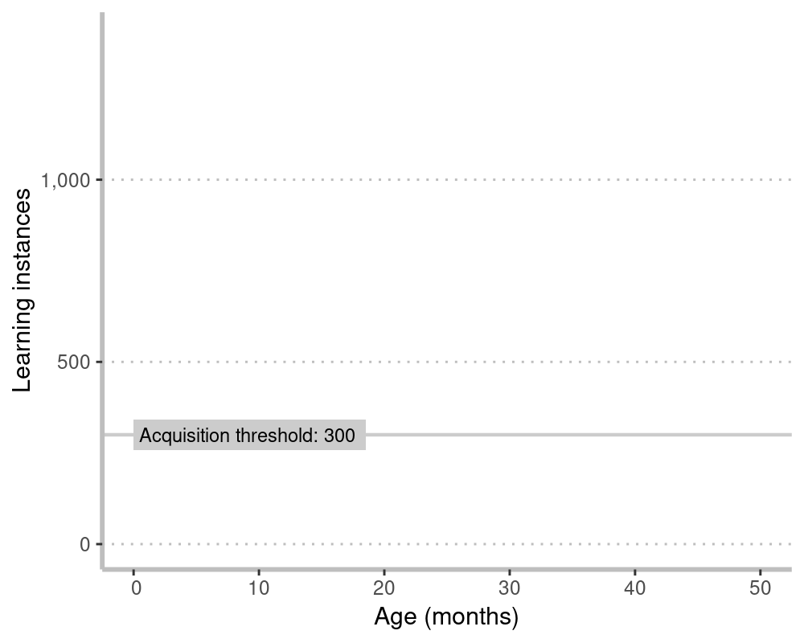{width="100%"}
:::::
::::
:::

## AMBLA: Simulating *monolingual* word acquisition

::: columns
:::: {.column width="40%"}
Catalan monolingual child

- /'gos/ (Catalan), 100%

**Parameters**:

$$
\begin{aligned}
\text{Threshold} = 300 \\
\text{Freq}_j \sim \text{Poisson}(\lambda = 50) 
\end{aligned}
$$
::::
:::: {.column width="60%"}
{width="100%"}
::::
:::

## AMBLA: Simulating *bilingual* word acquisition

::: box
3. **Linguistic input divided** into two languages: **Catalan 60%, Spanish 40%**

**Exposure**: Proportion of time exposed to the language of $j$ word
:::

. . .

Accumulation of learning instances, a function of **Exposure** and *Frequency*.

. . .

$$
\begin{aligned}
\textbf{For participant } &i \textbf{ and word-form } j \text{ (translation of } j'): \\
\text{Age of Acquisition}_{ij} &= \{\text{Age}_i \mid \text{Learning instances}_{ij} = \text{Threshold} \}\\
\text{Learning instances}_{ij} &= \text{Age}_i \cdot \text{Freq}_j \cdot {\color{myred}\text{Exposure}_{ij}}\\
\end{aligned}
$$

## AMBLA: Simulating *bilingual* word acquisition

**Parameters**:

::: columns
:::: {.column width="40%"}
Catalan monolingual child

- /'gos/ (Catalan), 100%

Catalan/Spanish bilingual child

- /'gos/ (Catalan), 60%

- /'pe.ro/ (Spanish), 40%

$$
\begin{aligned}
\text{Threshold} = 300 \\
\text{Freq}_j \sim \text{Poisson}(\lambda = 50)
\end{aligned}
$$
::::
:::: {.column width="60%"}
::::: fragment
{width="100%"}
:::::
::::
:::

## AMBLA: Simulating *bilingual* word acquisition

::: columns
:::: {.column width="40%"}
Catalan monolingual child

- /'gos/ (Catalan), 100%

Catalan/Spanish bilingual child

- /'gos/ (Catalan), 60%

- /'pe.ro/ (Spanish), 40%

**Parameters**:

$$
\begin{aligned}
\text{Threshold} = 300 \\
\text{Freq}_j \sim \text{Poisson}(\lambda = 50)
\end{aligned}
$$
::::
:::: {.column width="60%"}
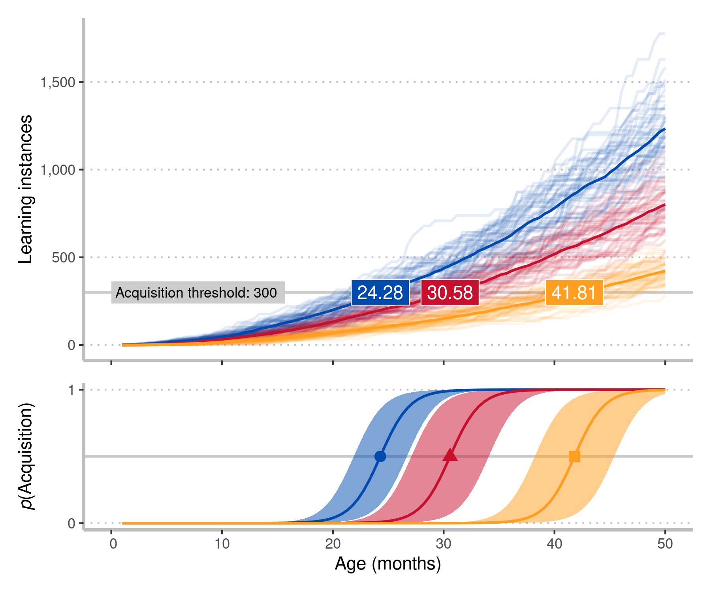{width="100%"}
::::
::: 

## AMBLA: Simulating a *cognate facilitation*

::: box

4. Words may accumulate additional learning instances from the **co-activation** of their (phonologically similar) **translation equivalent**

Degree proportional to their phonological similarity (**Cognateness**)
:::

. . .

$$
\begin{aligned}
\textbf{For participant } &i \textbf{ and word-form } j \text{ (translation of } j'): \\
\text{Age of Acquisition}_{ij} &= \{\text{Age}_i \mid \text{Learning instances}_{ij} = \text{Threshold} \}\\
\text{Learning instances}_{ij} &= \text{Age}_i \cdot \text{Freq}_j \cdot \text{Exposure}_{ij} + \\
&({\color{myred}\text{Learning instances}_{ij'} \cdot {\text{Cognateness}}_{j}})\\
\textbf{where:} \\
{\color{myred}\text{Cognateness}_{j,j'}}&{\color{myred} = \text{Levenshtein}(j, j')}
\end{aligned}
$$

## AMBLA: Simulating a *cognate facilitation*

::: columns
:::: {.column width="40%"}
Catalan monolingual child

- /'gat/ (Catalan), 100%

Catalan/Spanish bilingual child

- /'gat/ (Catalan), 60%

- /'ga.to/ (Spanish), 40%

$$
\begin{aligned}
\text{Threshold} = 300 \\
\text{Freq}_j \sim \text{Poisson}(\lambda = 50) \\
\text{Cognateness}_{j,j'} = 0.75
\end{aligned}
$$
::::
:::: {.column width="60%"}
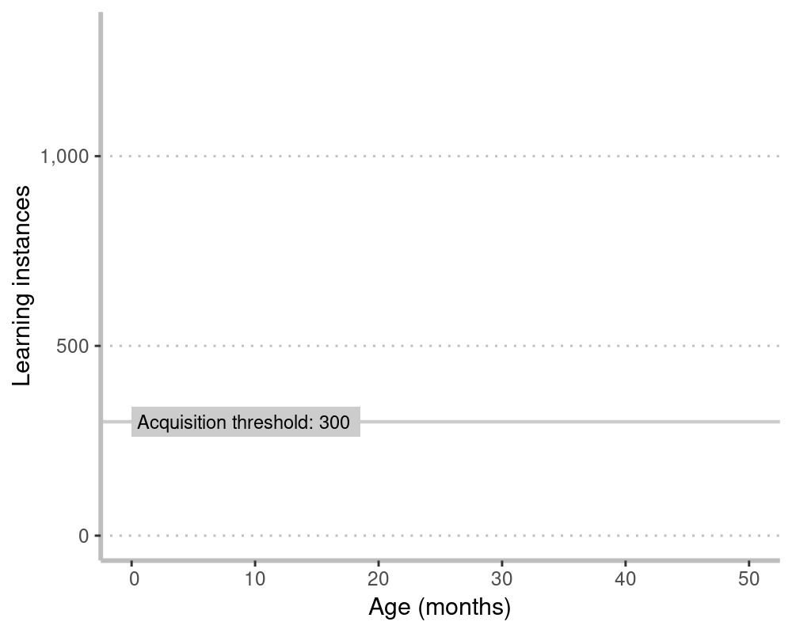
::::
:::

## AMBLA: Simulating a *cognate facilitation*

::: columns
:::: {.column width="40%"}

Catalan monolingual child:

- /'gat/ (Catalan), 100%

Catalan/Spanish bilingual child:

- /'gat/ (Catalan), 60%

- /'ga.to/ (Spanish), 40%

$$
\begin{aligned}
\text{Threshold} = 300 \\
\text{Freq}_j \sim \text{Poisson}(\lambda = 50) \\
\text{Cognateness}_{j,j'} = 0.75
\end{aligned}
$$
::::
:::: {.column width="60%"}

::::
:::

---

### Predictions

::: box
1. Cognates acquired **earlier** than non-cognates
2. Cognateness facilitation stronger in the **lower-exposure language**
:::

---

### Predictions

1. Cognates acquired **earlier** than non-cognates
2. Cognateness facilitation stronger in the **lower-exposure language**

### Barcelona Vocabulary Questionnaire (BVQ)

::: columns
:::: {.column width="50%"}
::::: fragment
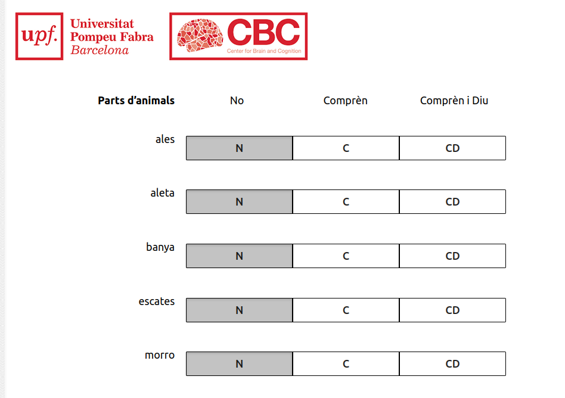{ width="100%" }
:::::
::::
:::: {.column width="50%"}
::::: fragment

 

- Online, open source  
- $\approx$ 1,600 words (800 Cat., 800 Spa.)
- 4 sublists, random allocation

:::::
::::
:::

## Results: Comprehension

Ordinal, multilevel (Bayesian) regression model

366 children (12-32 mo), 436 administrations $\times$ 604 noun words

$p(\text{Comprehension}, \text{Production}) \sim \text{Exposure}_{ij} \cdot \text{Cognateness}_j$

. . .

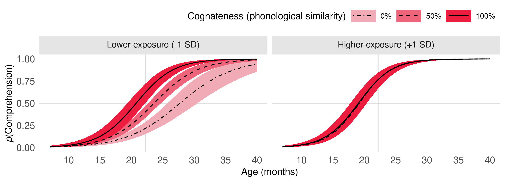

## Results: Production

Ordinal, multilevel (Bayesian) regression model

366 children (12-32 mo), 436 administrations $\times$ 604 noun words

$p(\text{Comprehension}, \text{Production}) \sim \text{Exposure}_{ij} \cdot \text{Cognateness}_j$

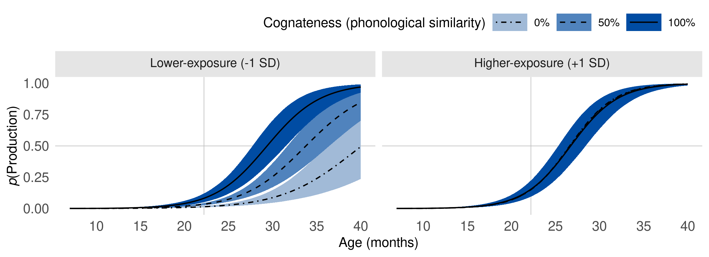

## Discussion

**Earlier acquisition** for **cognates** vs. non-cognates

. . .

Cognate facilitation **moderated by exposure**

> Only words from the lower exposure benefit from cognateness

. . .

Cognateness as a candidate mechanism underlying Floccia et al.'s results

. . .

Cross-language facilitation via co-activation of phonologically similar translation equivalents

. . .

::: box
**Is language-non selectivity already present in the initial lexicon?**
:::

# Study 2 {.inverse}

Developmental trajectories of bilingual spoken word recognition

## Language non-selectivity in the initial lexicon

Some evidence in infants and children [e.g., @vonholzen2012language; @singh2014one]

. . .

Methodological pitfalls: "Bilingual" task

::: columns
::: {.column width="30%"}
::: fragment

**Implicit naming task**

[@mani2010infant; @mani2011phonological]

English monolinguals
{width="80%"}
:::
:::
::: {.column width="70%"}
::: fragment
{width="100%"}
:::
:::
:::
:::

## Implicit naming task

Mani and Plunkett (2010, 2011)

{width="80%"}

## Study 2: Design

## Study 2: Design

Extending the task to test cross-language priming in bilinguals.

::: columns
:::: {.column width="30%"}
Change in order of  trial timecourse:

 

**Auditory label *before* target-distractor images**

Length of Catalan and Spanish words

Temporal proximity of prime and target labels
::::
:::: {.column width="70%"}

::::
:::

---

## Predictions and dataset

::: columns
::: {.column width="50%"}
::: fragment
::: box
**Exp. 1: Monolinguals**
:::
Replicate **within-language phonological interference** from Mani and Plunkett (*proof of concept*)
:::
:::
::: {.column width="50%"}
::: fragment
::: box
**Exp. 2: Monolinguals and bilinguals**
:::
If **language non-selectivity**, **stronger interference** in cognate vs. non-cognate trials
:::
:::
:::

::: columns
::: {.column width="50%"}
::: fragment
**79 English monolinguals**

> 89 sessions
:::
:::
::: {.column width="50%"}
::: fragment
**77 Catalan/Spanish monolinguals**

> 107 sessions

**78 Catalan/Spanish bilinguals**

> 133 sessions 
:::
:::
:::

---

## Experiment 1: Results, Bayesian GAMMs

::: columns
::: {.column width="30%"}
::: box
**No evidence of phonological priming**

Related trials $\approx$ Unrelated trials
:::
:::
::: {.column width="70%"}
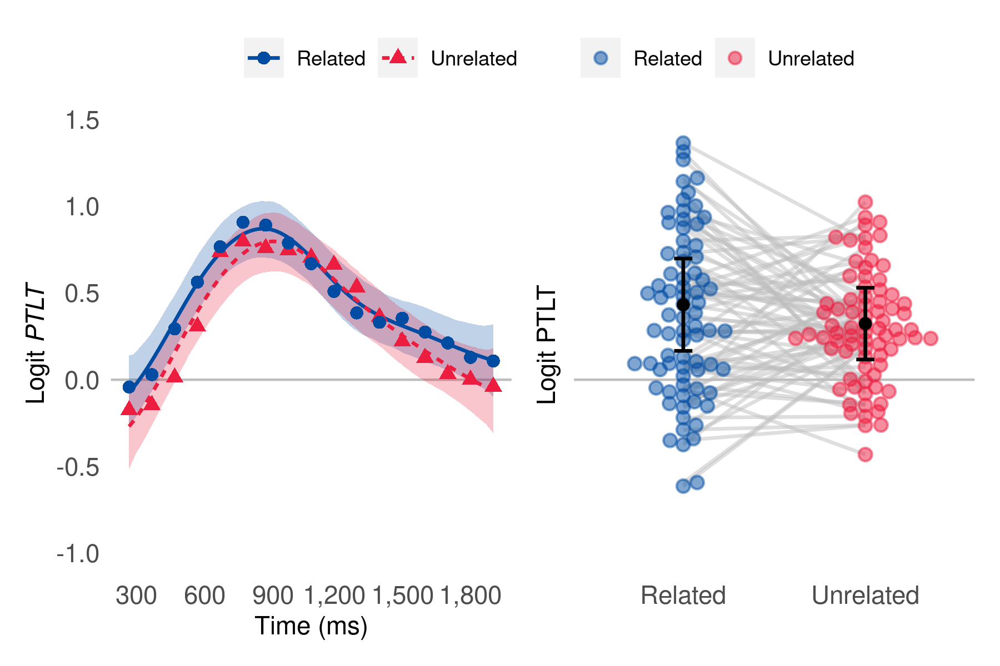
:::
:::

## Experiment 2: Results, Bayesian GAMMs

::: columns
::: {.column width="30%"}
::: box
**No evidence of phonological priming**

Related trials $\approx$ Unrelated trials
Cognate trials $\approx$ Non-cognate trials
:::

:::
::: {.column width="70%"}
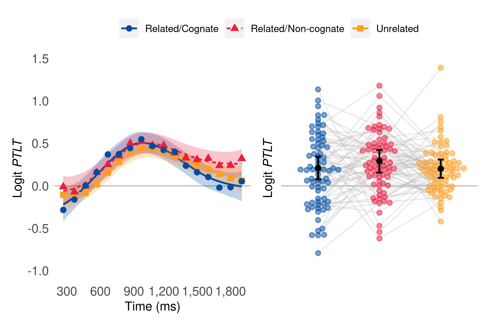
:::
:::

## Experiment 2: results, Bayesian GAMMs

::: columns
::: {.column width="30%"}
::: box
**No evidence of phonological priming**

Related trials $\approx$ Unrelated trials
Cognate trials $\approx$ Non-cognate trials
:::

:::
::: {.column width="70%"}

:::
:::

## Discussion

 

**Successful spoken word recognition** across ages and language profiles

. . .

**No evidence of priming effects**, within or across languages

> Unsuccessful retrieval of prime phonological forms?

. . .

Inconclusive results, revise design

# General discussion {.inverse}

## Summary

**Cognateness facilitates word acquisition** in the **lower-exposure language**

. . .

Candidate **mechanism** behind bilingual vocabulary growth

> AMBLA: Cross-language accumulation of learning instances

...

**Language non-selectivity** in the initial lexicon: Pending testing

## Theoretical contributions

### Whats not in this dissertation

* `semantic-inhibition`: Data collection ongoing
* `translation-elicitation`: In preparation

## Methodological contributions

::: columns
::: {.column width="50%"}
### Methods

* Sample size (***N*** = XX)
* **Bayesian modelling**: Quantifying uncertainty, estabilising statistical inference

:::
::: {.column width="50%"}
::: fragment
### Software

Barcelona Vocabulary Questionnaire (**BVQ**) 

> bvq  package + 

:::
::: fragment

**Levenshtein distance** as a valid measure of word-level effects of phonological similarity

> jtracer  package
:::
:::
:::

## Future steps

::: incremental
- The impact of cognateness in spoken word recognition: *Re-analysing data from Study 2*
- Disentangling lexical similarity from **phonemic overlap**: Basque, Greek
- Bilingualism and concept lexicalisation: **Backward Semantic Inhibition**
:::

--- 

::: {.r-fit-text}
Thanks!
:::

# Appendix

## Introduction: Bilingualism

## Introduction: Cognate contents in the aggregated vocabulary

## Study 1: Posterior regression coefficients

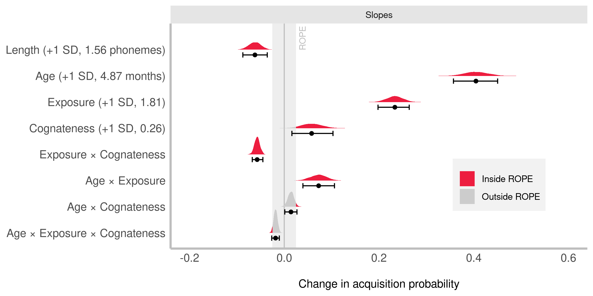

## Study 1: MCMC convergence ($\hat{R}$)

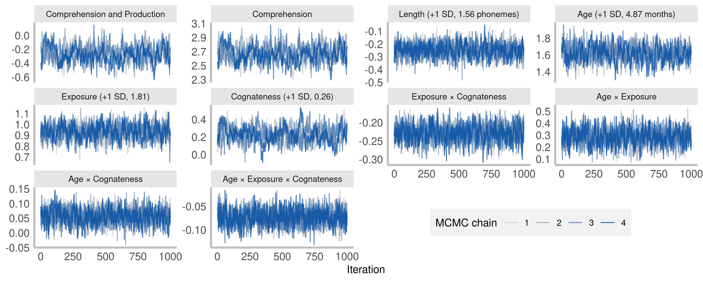

## Study 2: Predictions

- Successful spoken word recognition across groups
- If language non-selectivity, stronger interference in cognate vs. non-cognate trials

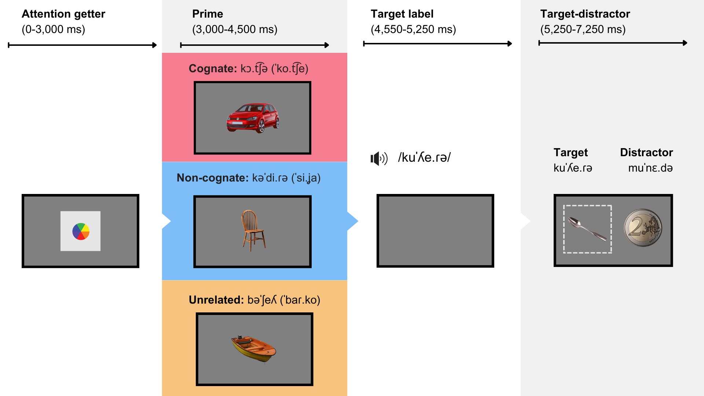

## Study 2: Vocabulary size

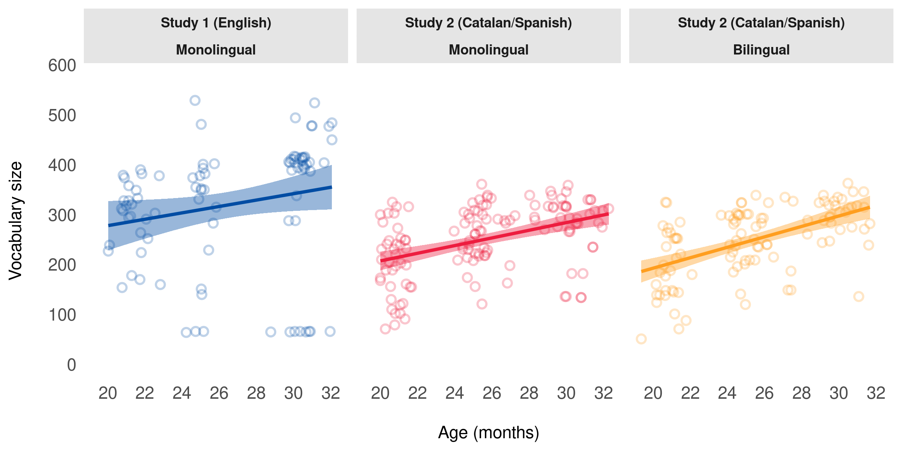

## Study 2: Model convergence (Exp. 1)

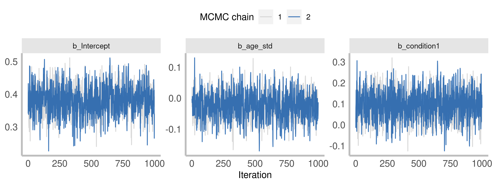

## Study 2: Model convergence (Exp. 2)

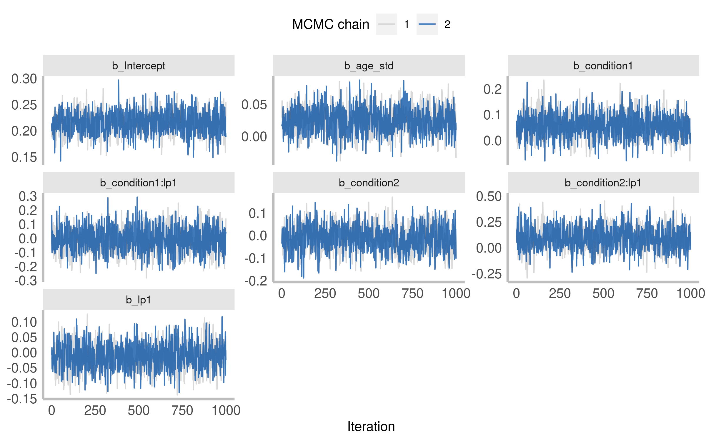

## References

